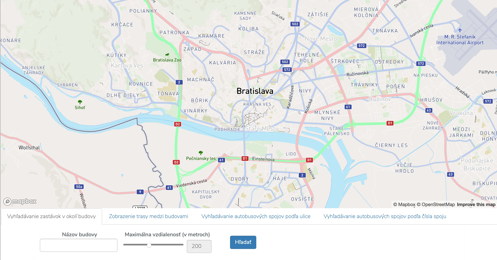
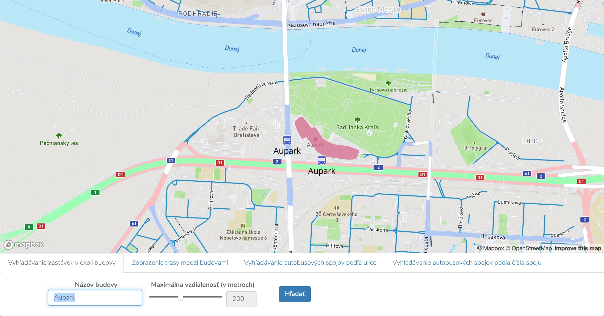
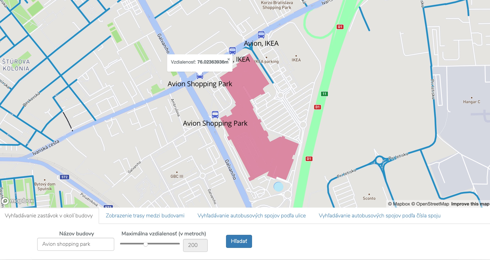
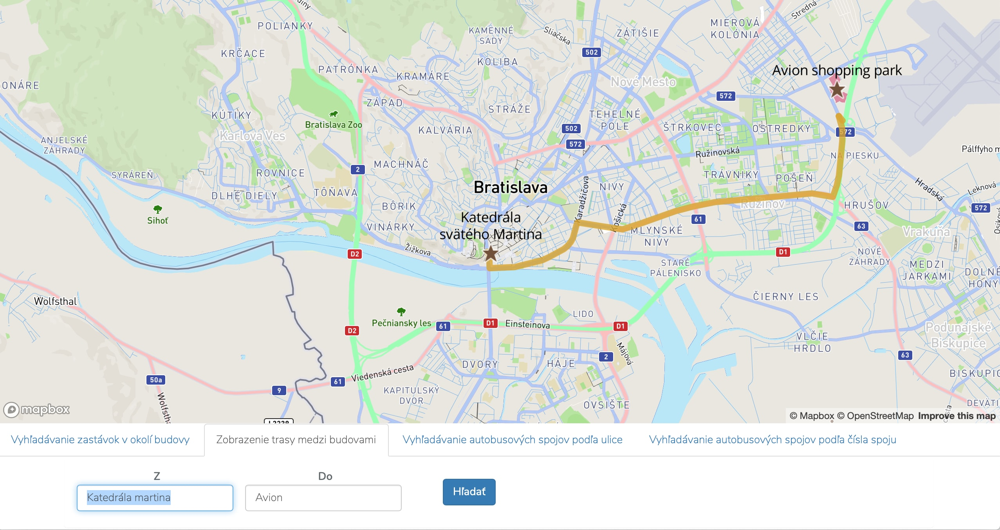
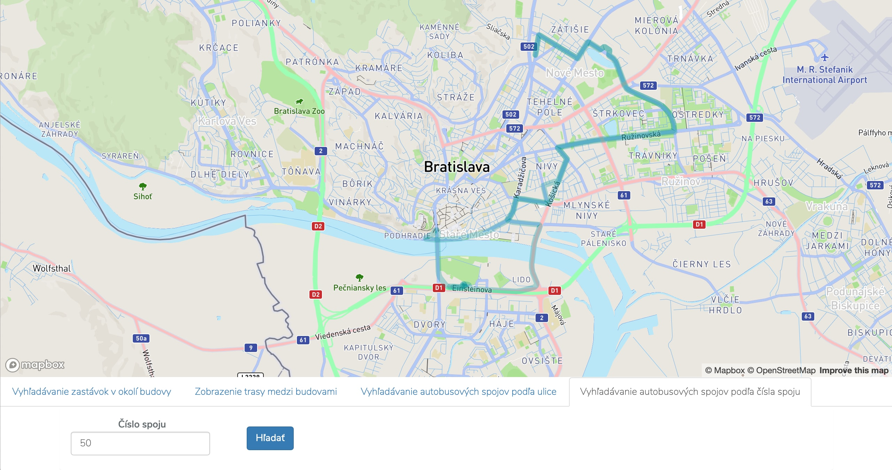
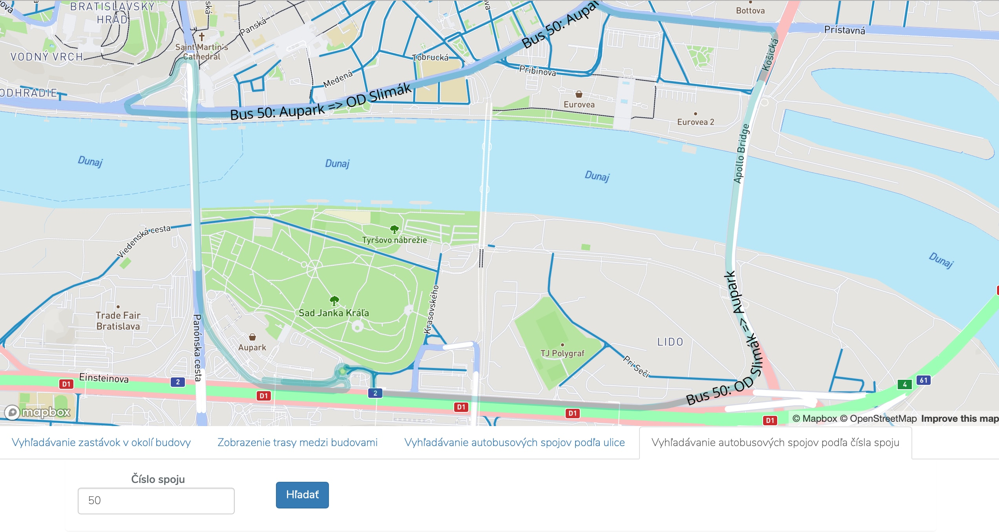
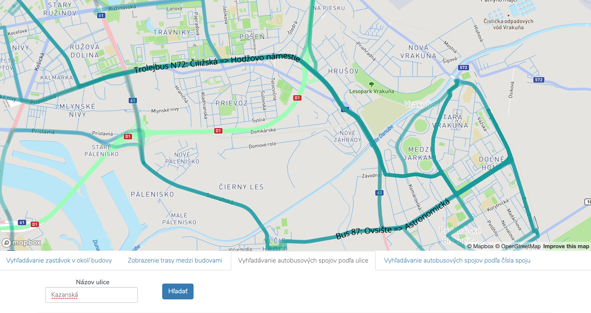

**Autor**: Peter Tibenský
#1	Cieľ projektu
Cieľom projektu je vytvoriť webovú aplikáciu, ktorá umožňuje zobrazovať geografické dáta na mape a filtrovať, prípadne vyhľadávať v nich. Aplikácia má pozostávať zo serverovej časti, klientskej časti a mapy, ktorá obsahuje vlastný štýl.
#2	Realizácia
Ako doménu projektu som sa rozhodol použiť dopravu, nad ktorou som vytvoril štyri prípady použitia, ktoré riešia určitú problematiku v tejto doméne.
##2.1	Programové prostredie, nástroje, dáta
Projekt som sa rozhodol realizovať v programovacom jazyku PHP s využitím frameworku Laravel . Ten umožňuje vytvorenie klient-server webovej aplikácie. Dáta, nad ktorými pracujem pozostávajú z oblasti Bratislavy, sú získané z webovej stránky openstreetmap  a obsahujú celkovo dát.
##2.2	Dátový model
Dáta stiahnuté zo stránky openstreetmap vo formáte OSM som importoval do databázy PostgreSQL prostredníctvom nástroja osm2pgsql. Ten vytvoril dátový model pozostávajúci s nasledujúcich databázových tabuliek:
- planet_osm_line
    - tabuľka obsahujúca línie ako sú cesty, dopravné trasy a iné
- planet_osm_point
    - tabuľka obsahujúca body ako sú reštaurácie, bary, zastávky a iné
- planet_osm_polygon
    - tabuľka obsahujúca mnohouholníky ako sú budovy, oblasti a parkoviská
- planet_osm_roads
    - tabuľka obsahujúca cesty
Nakoľko dáta obsahovali súradnice v inom ako preferovanom formáte, program osm2pgsql som spustil s prepínačom latlong, ktorý súradnice v geometriách prekonvertoval do správneho formátu.
Okrem týchto tabuliek som vzhľadom na prípad použitia, ktorý rieši výpočet trasy medzi dvoma bodmi, potreboval rozšíriť dátový model tak, aby bol kompatibilný s nástrojom pgRouting , ktorý obsahuje funkcie zjednodušujúce výpočet trasy medzi dvoma bodmi. Tabuľku planet_osm_roads som preto rozšíril o stĺpce source a target, ktoré vyjadrujú začiatok a koniec danej cesty. Po spustení inicializačného nástroja pgRouting sa tieto stĺpce naplnili údajmi a vytvorila sa nová tabuľka planet_osm_roads_vertices_pgr obsahujúca vrcholy ciest a závislosti medzi nimi.
##2.3	Implementácia prípadov použitia, dopyty, indexy, vlastný štýl máp
Táto sekcia opisuje funkcionalitu aplikácie, SQL dopyty nad databázou PostGIS a využitie indexov pre efektívne vyhľadávanie.

###Použité indexy:
V databáze som vytvoril niekoľko indexov, ktoré urýchlili vykonávanie dopytov opísaných v nasledujúcich kapitolách.
```postgresql
-- pre rýchlejšie fulltext vyhľadávanie
CREATE INDEX index_tsquery_names ON planet_osm_polygon USING GIN (to_tsvector('simple', name));
CREATE INDEX index_tsquery_street_names ON planet_osm_line USING GIN(to_tsvector('simple', name));

-- pre rýchlejšie vyhľadávanie trasy, kde sa používa Dijkstrov algoritmus
CREATE INDEX index_vertices_ids ON planet_osm_roads_vertices_pgr(id);
CREATE INDEX index_vertices ON planet_osm_roads_vertices_pgr USING GIST(the_geom);

-- pre rýchlejšie vyhľadávanie polygonov, bodov a čiar na základe ich geometrie
CREATE INDEX index_polygon ON planet_osm_polygon USING GIST (way);
CREATE INDEX index_point ON planet_osm_point USING GIST (way);
CREATE INDEX index_line ON planet_osm_line USING GIST (way);
```

### Vlastný štýl máp
Táto aplikácia využíva upravený štýl máp.
Štýly sú upravené prostredníctvom nástroja Mapbox Studio.
Nakoľko je aplikácia zameraná na dopravu, v mape sú upravené farby diaľnic (zelea farba), ciest prvej triedy (červená farba) a ciest druhej triedy (sivomodrá).
Tiež je upravená farba parkov na jemnejšiu zelenú, aby tieto menej podstatné objekty (vzhľadom na charakter aplikácie) nerušili používateľa.

U ciest je upravená aj šírka čiarky vzhľadom na priblíženie, čo umožňuje lepšie zvýraznenie hlavných ciest.



##2.3.1	Vyhľadávanie zastávok v okolí budovy
Prvý prípad použitia poskytuje používateľovi informácie o najbližších zastávkach verejnej dopravy v blízkosti budovy, pri ktorej chce používateľ nájsť zastávky. Používateľ tiež môže zadať maximálnu vzdialenosť zastávky od budovy. Používateľovi sa na mape zobrazia zastávky spĺňajúce tieto kritériá v podobe ikony autobusu, názvu zastávky a po kliknutí na ikonu si používateľ môže pozrieť aj vzdialenosť zastávky od budovy v metroch.


Po klinutí na ikonku zastávky sa zobrazí jej vzdialenosť od budovy:


Použitý Dopyt:
```postgresql
WITH buildings AS(
SELECT p.name, st_asgeojson(p.way) as geojson, p.way, 'building' AS type, st_asgeojson(st_centroid(p.way)) as center FROM planet_osm_polygon p
WHERE to_tsvector('simple', p.name) @@ plainto_tsquery('simple', :name)
)
SELECT p.name, 
        st_asgeojson(p.way) AS geojson,
        p.way as bus_way,
        'bus' AS type,
        
        b.name as building_name,
        b.geojson as building_geojson,
        b.way as building_way,
        b.center as building_center,
        
        st_distance_sphere(p.way::geometry, b.way::geometry) AS distance 
FROM planet_osm_point p
CROSS JOIN buildings AS b
WHERE p.public_transport IS NOT NULL
AND p.operator = 'DPB'
AND  st_dwithin(p.way::geography, b.way::geography, :distance)
;
```
Vysvetlenie dopytu:
Select *buildings* fulltextovo vyhľadá budovy, ktorých meno je totožné s premennou *:name*. 
Výsledok vstupuje do hlavného selectu, kde sa vyhľadávajú zastávky (reprezentované ako body), ktoré sú v okolí nájdených budov

API: ```/api/busstops?text=Aupark&distance=200```

##2.3.2	Vyhľadávanie trasy medzi dvoma budovami
Používateľ zadá názov počiatočnej a cieľovej budovy, medzi ktorými sa potrebuje premiestniť. Aplikácia využitím nástroja pgRouting a Dijkstrovho algoritmu na nájdenie najkratšej trasy nájde vhodnú trasu a tú zobrazí používateľovi na mape, spoločne s vyznačením počiatočnej a cieľovej destinácie.



Použitý dopyt:
```postgresql
WITH fromtable AS (
    SELECT r.id, st_asgeojson(r.the_geom), st_asgeojson(p.way) as geojson, p.name as name, p.way FROM planet_osm_roads_vertices_pgr r
      CROSS JOIN planet_osm_polygon p
      CROSS JOIN planet_osm_roads roads
    WHERE to_tsvector('simple', p.name) @@ plainto_tsquery('simple', :from)
          AND roads.highway IS NOT NULL
          AND st_touches(roads.way::geometry, r.the_geom)
    ORDER BY st_distance(p.way::geometry, roads.way::geometry) LIMIT 1
), totable AS (
    SELECT r.id, st_asgeojson(r.the_geom), st_asgeojson(p.way) as geojson, p.name as name, p.way FROM planet_osm_roads_vertices_pgr r
      CROSS JOIN planet_osm_polygon p
      CROSS JOIN planet_osm_roads roads
    WHERE to_tsvector('simple', p.name) @@ plainto_tsquery('simple', :to)
          AND roads.highway IS NOT NULL
          AND st_touches(roads.way::geometry, r.the_geom)
    ORDER BY st_distance(p.way::geometry, roads.way::geometry) LIMIT 1
), route AS (
    SELECT * FROM pgr_dijkstra('
        SELECT osm_id AS id, source, target, st_length(way::geometry) AS cost
        FROM planet_osm_roads',
                               (SELECT id FROM fromtable), (SELECT id FROM totable), directed := False
    )
)
SELECT st_asgeojson(v.the_geom) as geojson, 
  fromtable.geojson as geojson_from, 
  fromtable.name as name_from,
  totable.geojson as geojson_to,
  totable.name as name_to,
  st_asgeojson(st_centroid(fromtable.way::geometry)) as centroid_from,
  st_asgeojson(st_centroid(totable.way::geometry)) as centroid_to
FROM planet_osm_roads_vertices_pgr v
  CROSS JOIN fromtable
  CROSS JOIN totable
  INNER JOIN route r ON r.node = v.id
;
```
Vysvetlenie dopytu:
Select najprv získa geometrie počiatočnej a cieľovej budovy a cesty, s ktorou sa jednotlivé budovy dotýkajú.
Následne pomocou Dijkstrovho algoritmu nájde najkrajtšiu trasu medzi nimi.

API: ```GET /api/route?from=Avion&to=Aupark```

##2.3.3	Vyhľadávanie trás vozidiel verejnej dopravy na základe čísla spoju
Používateľ má taktiež možnosť vykresliť trasu konkrétneho spoju. Stačí, ak zadá číslo tohto spoju a aplikácia mu zobrazí celú trasu spoločne s vyznačením, o ktorý smer spoju sa jedná (z počiatočnej zastávky A do konečnej B, alebo zo zastávky B do A) .



Po dostatočnom priblížení sa zobrazí aj číslo spoju a trasa:



Dopyt:
```postgresql
SELECT l.name AS buslabel, st_asgeojson(l.way) AS geojson FROM planet_osm_line l
WHERE to_tsvector('simple', l.name) @@ plainto_tsquery('simple', :number)
AND l.operator = 'DPB'
;
```
Vysvetlenie dopytu:
Select fulltextovým vyhľadávaním nájde číslo zadaného spoju. Tabuľka *planet_osm_line* obsahuje informácie o trasách vozidiel verejnej dopravy, čo umožňuje zobrazenie ich trasy.

API: ```GET /api/publicTransport?busNumber=67```

##2.3.4	Vyhľadávanie trás vozidiel verejnej dopravy na základe ulice, cez ktorú prechádzajú
Používateľ využívajúci verejnú dopravu si taktiež môže vyhľadať, ktoré spoje prechádzajú nim zadanou ulicou. Aplikácia vyhľadá spoje MHD, ktoré touto ulicou prechádzajú, získa trasu týchto spojov a tie zobrazí používateľovi na mape spoločne s informáciou, ktorý spoj danej trase prináleží.


Dopyt:
```postgresql
SELECT DISTINCT street.name, p.name AS buslabel, st_asgeojson(p.way) AS geojson FROM planet_osm_line p
JOIN planet_osm_line street ON st_intersects(street.way::geometry, p.way::geometry)
WHERE to_tsvector('simple', street.name) @@ plainto_tsquery('simple', :street)
AND p.operator = 'DPB'
;
```

Vysvetlenie dopytu:
Na základe fulltextového vyhľadávanie v tabuľke *planet_osm_line* sa vyhľadá názov ulice zadanej používateľom.
Následne sa prostredníctvom funkcie *ts_intersects* získajú tie trasy MHD, ktoré sa prekrývajú z líniou zadanej ulice.

API: ```GET /api/publicTransportByStreet?street=Kazanská```
# Použité nástroje, zdroje
- [PostgreSQL v10.5](https://www.postgresql.org)
- [The Laravel Framework v5.7](https://laravel.com)
- [Open Street Map](https://openstreetmap.org)
- [OSM2PGSQL](https://github.com/openstreetmap/osm2pgsql)
- [PGRouting](https://pgrouting.org)
